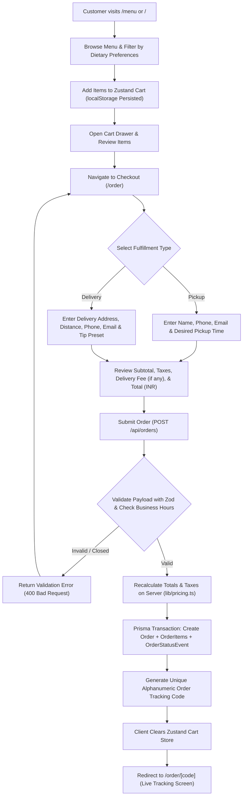
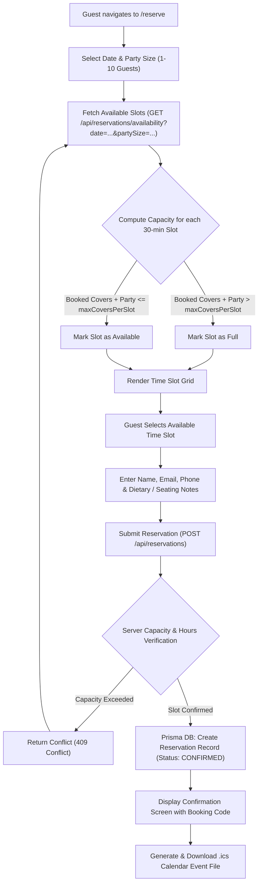
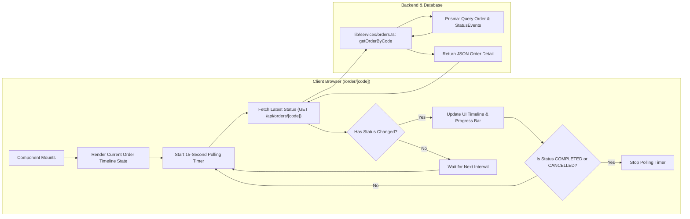
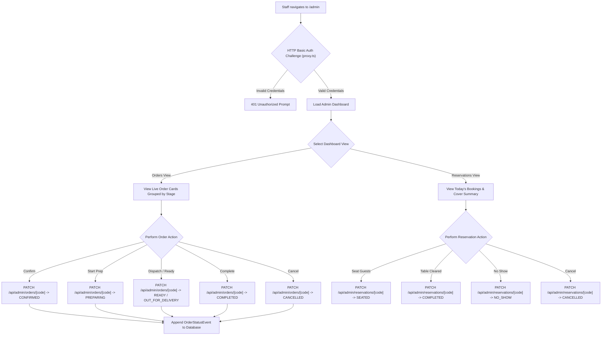
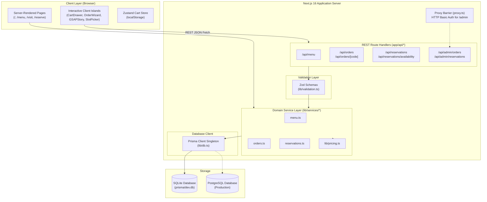
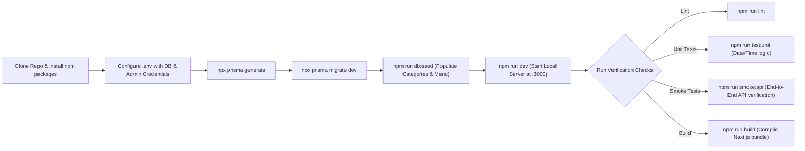

# Ember House - Restaurant Web Platform

Ember House is a full-stack, mobile-first restaurant web platform built with Next.js 16 (App Router), React 19, TypeScript, Tailwind CSS v4, Prisma ORM, and GSAP motion. The application provides an interactive dining menu with dynamic dietary filtering, a real-time table reservation engine with capacity controls, an online ordering system for pickup and delivery with live status tracking, and a protected staff administration dashboard.

---

## Table of Contents

- [Overview](#overview)
- [Key Features](#key-features)
- [Project Workflows](#project-workflows)
  - [1. Customer Online Ordering and Checkout Workflow](#1-customer-online-ordering-and-checkout-workflow)
  - [2. Table Reservation and Capacity Engine Workflow](#2-table-reservation-and-capacity-engine-workflow)
  - [3. Live Order Tracking and Synchronization Workflow](#3-live-order-tracking-and-synchronization-workflow)
  - [4. Staff Administration and Kitchen Operations Workflow](#4-staff-administration-and-kitchen-operations-workflow)
  - [5. System Architecture and Data Flow](#5-system-architecture-and-data-flow)
  - [6. Development, Migration, and Testing Workflow](#6-development-migration-and-testing-workflow)
- [Technology Stack](#technology-stack)
- [Project Structure](#project-structure)
- [Database Schema](#database-schema)
- [REST API Reference](#rest-api-reference)
- [Getting Started](#getting-started)
  - [Prerequisites](#prerequisites)
  - [Installation](#installation)
  - [Environment Configuration](#environment-configuration)
  - [Database Initialization](#database-initialization)
  - [Running the Application](#running-the-application)
- [Testing and Verification](#testing-and-verification)
- [Configuration and Customization](#configuration-and-customization)
- [Security and Access Control](#security-and-access-control)
- [Production Deployment](#production-deployment)
- [License](#license)

---

## Overview

Ember House is engineered to bridge customer-facing discovery with back-of-house operations. Key design decisions include:

- Strict separation of concerns: Server Components handle SEO-critical rendering and static content, client islands manage stateful interactions (cart, booking wizard, animations), and a dedicated service layer (`lib/services/*`) enforces business rules.
- Type safety: Zod schemas validate data on both client input and API boundaries, sharing types across the entire application stack.
- Zero external runtime dependencies for baseline storage: SQLite is used for local development, easily switching to PostgreSQL for production deployments via Prisma.
- Robust state management: Client-side cart persistence via Zustand with automatic local storage synchronization and price calculations in integer currency units.

---

## Key Features

### Interactive Digital Menu
- Categorized navigation across starters, mains, wood-fired pizzas, smash burgers, desserts, and beverages.
- Dynamic dietary filters for Gluten-Free (`GF`), Vegetarian (`VG`), Vegan (`V`), Dairy-Free (`DF`), and Nut-Free (`NF`).
- High-resolution imagery, allergen tags, calorie counts, and availability statuses.

### Capacity-Aware Table Reservation Engine
- 30-minute interval booking slots with dynamic cover capacity calculations (`maxCoversPerSlot`) to avoid overbooking.
- Real-time availability checks based on existing confirmed bookings and operational hours.
- Automatic generation of `.ics` calendar files compatible with Apple Calendar, Google Calendar, and Outlook.
- Frictionless guest booking flow requiring no account creation.

### Online Ordering (Pickup and Delivery)
- Persistent shopping cart backed by Zustand with local storage hydration.
- Business rule pricing engine calculating taxes, delivery fee tiers, free delivery thresholds, and customizable tips.
- Delivery radius verification and minimum order subtotal enforcement.
- Support for pickup scheduling with configured lead times.

### Live Order Status Tracker
- Dedicated tracking interface (`/order/[code]`) with stage-by-stage visual progression.
- Automated client polling against backend status endpoints.
- Event audit history tracking status transitions from submission to completion.

### Staff Administration Dashboard (`/admin`)
- Real-time incoming order feed with single-click status updates (`Confirm`, `Prepare`, `Dispatch / Ready`, `Complete`, `Cancel`).
- Daily cover tracking, guest roster inspection, and reservation status controls (`Seated`, `Completed`, `No-Show`, `Cancelled`).
- Protected by HTTP Basic Authentication at the proxy layer.

### Motion and Design System
- GSAP 3 scroll-triggered brand storytelling narratives.
- Interactive showcase card stacks for signature dishes.
- Accessible UI components built on Radix UI primitives and styled with Tailwind CSS v4.
- Mobile-first responsive layout with sticky action bars and slide-over drawers.

### SEO and Performance
- Server-Side Rendering (SSR) and Incremental Static Regeneration (ISR) for fast First Contentful Paint (FCP).
- Schema.org `Restaurant` JSON-LD structured data for Google Search rich results.
- Dynamic OpenGraph metadata, XML sitemap (`sitemap.ts`), and robots rules (`robots.ts`).

---

## Project Workflows

### 1. Customer Online Ordering and Checkout Workflow

This workflow describes the complete lifecycle of an online order from menu discovery to order placement and database persistence.



#### Detailed Steps:
1. **Selection and Cart Management**: Items added from the menu are stored in a client-side Zustand store. Item quantities, special instructions, and item IDs are retained across page navigations and browser refreshes.
2. **Checkout Configuration**: The customer selects between Pickup and Delivery. For delivery, the distance is verified against `ordering.maxDeliveryRadiusMiles`, and the subtotal is verified against `ordering.minimumDeliverySubtotalCents`.
3. **Server Validation**: The payload is sent to `POST /api/orders`. The server uses Zod to validate customer inputs, verifies operating hours via `lib/services/orders.ts`, and re-computes all monetary calculations to prevent client tampering.
4. **Persistence**: An `Order` record, associated `OrderItem` snapshots, and an initial `OrderStatusEvent` (status: `PENDING`) are written inside a database transaction.
5. **Redirection**: The client receives the order code and is redirected to the tracking page.

---

### 2. Table Reservation and Capacity Engine Workflow

This workflow illustrates how guests check table availability, book reservations, and receive calendar invites while the system enforces dining room capacity rules.



#### Detailed Steps:
1. **Slot Calculation**: The availability endpoint checks existing confirmed reservations for the requested date, aggregates booked guest counts for each 30-minute window, and compares against `siteConfig.reservations.maxCoversPerSlot` (default: 32 covers).
2. **Form Validation**: Submissions are validated against `reservationSchema`, ensuring valid date formats, valid operational hours, and guest contact numbers.
3. **Atomic Booking**: The reservation is saved with status `CONFIRMED` and assigned a short booking code.
4. **Calendar Integration**: The confirmation interface offers an instant `.ics` file download containing event timestamps, address, Google Maps link, and party details.

---

### 3. Live Order Tracking and Synchronization Workflow

This workflow covers how customers monitor real-time order status updates and how the frontend synchronizes with backend state changes.



#### Order Status Stages:
- `PENDING`: Order submitted, awaiting staff review.
- `CONFIRMED`: Staff acknowledged the order.
- `PREPARING`: Kitchen is actively cooking the order.
- `READY` (Pickup) / `OUT_FOR_DELIVERY` (Delivery): Order is staged for pickup at the counter or handed to the delivery courier.
- `COMPLETED`: Order successfully handed over to customer.
- `CANCELLED`: Order rejected or cancelled by staff.

---

### 4. Staff Administration and Kitchen Operations Workflow

This workflow outlines how staff members manage the active service floor, process orders, and handle guest seating through the `/admin` portal.



---

### 5. System Architecture and Data Flow

This diagram illustrates the architectural boundaries and data communication pathways across the entire stack.



---

### 6. Development, Migration, and Testing Workflow

This diagram highlights the local development, database lifecycle, and automated verification process.



---

## Technology Stack

| Layer | Technology | Purpose |
|---|---|---|
| **Framework** | Next.js 16 (App Router), React 19 | Server-side rendering, API route handlers, static page generation |
| **Language** | TypeScript (Strict Mode) | Full-stack type safety across models, services, and UI components |
| **Styling** | Tailwind CSS v4, PostCSS | Modern utility-first CSS design system |
| **UI Components** | Radix UI Primitives, shadcn/ui | Accessible sheets, dialogs, dropdowns, tabs, and buttons |
| **Icons** | Lucide React | Clean, scalable interface icons |
| **Animations** | GSAP 3, `@gsap/react`, ScrollTrigger | Scroll-driven brand narratives and interactive dish showcases |
| **Client State** | Zustand | Persistent shopping cart with local storage synchronization |
| **Validation** | Zod 4 | Shared validation schemas for forms and API requests |
| **ORM & Database** | Prisma 7, SQLite (Dev) / PostgreSQL (Prod) | Schema migrations, type-safe database queries, and seeding |
| **Notifications** | Sonner | Accessible toast notifications |
| **Formatting** | Native Intl (currency in INR, localized dates/times) | Indian Rupee formatting and Asia/Kolkata timezone support |

---

## Project Structure

```plaintext
respro/
├── app/                          # Next.js App Router root
│   ├── (site)/                   # Public site layout and routes
│   │   ├── menu/                 # Interactive menu with dietary filter
│   │   ├── order/                # Checkout and live order tracking ([code])
│   │   ├── reserve/              # Table reservation flow and ICS download
│   │   ├── visit/                # Location, opening hours, FAQ, and map
│   │   └── page.tsx              # Home page with GSAP story-scroll
│   ├── admin/                    # Staff management dashboard
│   ├── api/                      # REST API route handlers
│   │   ├── admin/                # Protected admin order/reservation endpoints
│   │   ├── menu/                 # Public menu listing endpoint
│   │   ├── orders/               # Order creation and tracking endpoints
│   │   └── reservations/         # Availability and reservation endpoints
│   ├── demos/                    # Component showcase demos
│   ├── globals.css               # Design system tokens and Tailwind imports
│   ├── layout.tsx                # Root layout with fonts, cart hydrator, and toasts
│   ├── robots.ts                 # SEO robots.txt configuration
│   └── sitemap.ts                # SEO XML sitemap generator
├── components/                   # Reusable UI component modules
│   ├── admin/                    # Staff order cards, status transition buttons
│   ├── cart/                     # Cart slide-over sheet, line items, quantity controls
│   ├── home/                     # Story scroll sections and signature dish stack
│   ├── menu/                     # Category lists, item cards, dietary filters
│   ├── order/                    # Checkout forms, order summary, tracking view
│   ├── reserve/                  # Date strip, time slot grid, booking confirmation
│   ├── seo/                      # JSON-LD Schema.org structured data
│   ├── site/                     # Header, footer, live clock, mobile action bar
│   └── ui/                       # shadcn/ui and custom animation primitives
├── lib/                          # Application core and domain services
│   ├── data/                     # Seed data (curated dishes, categories, images)
│   ├── services/                 # Server-only domain services (Menu, Orders, Reservations)
│   ├── store/                    # Zustand client state stores (Cart)
│   ├── constants.ts              # System enums and dietary constants
│   ├── db.ts                     # Prisma client singleton
│   ├── format.ts                 # Currency (INR), date, time, and phone formatters
│   ├── pricing.ts                # Order subtotal, delivery fee, and tax calculations
│   ├── site-config.ts            # Single source of truth for restaurant facts and hours
│   ├── types.ts                  # Shared TypeScript models and API contracts
│   └── validation.ts             # Zod validation schemas
├── prisma/                       # Database layer
│   ├── migrations/               # Prisma migration history
│   ├── schema.prisma             # Database schema definition
│   └── seed.ts                   # Database seeder script
├── docs/                         # Architecture documentation and specs
│   ├── ARCHITECTURE.md           # Full technical specifications and API contracts
│   └── RESUME.md                 # Project implementation status and notes
├── scripts/                      # Utility and smoke test scripts
│   └── smoke-api.mjs             # Automated API smoke test runner
├── proxy.ts                      # Basic Authentication middleware proxy
├── .env.example                  # Environment variables template
├── package.json                  # Dependencies and scripts
├── tsconfig.json                 # TypeScript configuration
└── next.config.ts                # Next.js configuration
```

---

## Database Schema

```plaintext
User ────────────────< Reservation
  │
  └──────────────────< Order ────────< OrderItem ───> MenuItem ───> Category
                         │
                         └───────────< OrderStatusEvent
```

### Models Summary

- **User**: Represents staff accounts (`CUSTOMER`, `STAFF`, `ADMIN`) and optional customer profiles.
- **Category**: Menu categories (e.g., Starters, Mains, Wood-Fired Pizza, Smash Burgers, Desserts, Drinks) with sort order.
- **MenuItem**: Dishes and beverages with prices in integer units (cents/paise), dietary tags, calorie counts, and availability flags.
- **Reservation**: Table bookings containing guest contact details, party size, reservation date/time, and status (`CONFIRMED`, `SEATED`, `COMPLETED`, `NO_SHOW`, `CANCELLED`).
- **Order**: Customer pickup and delivery orders with fulfillment details, calculated taxes, delivery fees, tips, and totals.
- **OrderItem**: Snapshot of ordered items including unit prices, quantities, and optional custom instructions.
- **OrderStatusEvent**: Timeline audit log tracking each status transition (`PENDING`, `CONFIRMED`, `PREPARING`, `READY`, `OUT_FOR_DELIVERY`, `COMPLETED`, `CANCELLED`) with timestamps and notes.

---

## REST API Reference

### Public Endpoints

| Method | Path | Description |
|---|---|---|
| `GET` | `/api/menu` | Fetches all active menu categories and available dishes |
| `POST` | `/api/orders` | Validates and creates a new pickup or delivery order |
| `GET` | `/api/orders/[code]` | Retrieves order status, item details, and event timeline by tracking code |
| `GET` | `/api/reservations/availability` | Computes open 30-minute reservation slots for a given date and party size |
| `POST` | `/api/reservations` | Validates and submits a new table reservation |
| `GET` | `/api/reservations/[code]` | Fetches reservation details by booking code |

### Staff Admin Endpoints (Protected by Basic Auth)

| Method | Path | Description |
|---|---|---|
| `GET` | `/api/admin/orders` | Retrieves active and historical orders with filtering |
| `PATCH` | `/api/admin/orders/[code]` | Updates an order status (e.g. `CONFIRMED`, `PREPARING`, `READY`, `COMPLETED`) |
| `GET` | `/api/admin/reservations` | Lists reservations filtered by date range or status |
| `PATCH` | `/api/admin/reservations/[code]` | Updates reservation seating status (`SEATED`, `COMPLETED`, `NO_SHOW`, `CANCELLED`) |

---

## Getting Started

### Prerequisites
- **Node.js**: `v20.x` or higher
- **Package Manager**: `npm` (or `pnpm` / `yarn`)

### Installation

1. Clone the repository:
   ```bash
   git clone https://github.com/namaysingh3925/RESPO.git
   cd RESPO
   ```

2. Install project dependencies:
   ```bash
   npm install
   ```

### Environment Configuration

Create a local `.env` file by copying the template:
```bash
cp .env.example .env
```

Configure your environment variables:
```env
# Database connection string (SQLite for local dev, PostgreSQL for production)
DATABASE_URL="file:./prisma/dev.db"

# Staff dashboard credentials for /admin
ADMIN_USER="admin"
ADMIN_PASSWORD="super-secret-admin-password"

# Set to "false" to bypass business hour checks during testing
ENFORCE_BUSINESS_HOURS="false"

# Base URL for metadata and absolute links
NEXT_PUBLIC_SITE_URL="http://localhost:3000"
```

### Database Initialization

1. Generate the Prisma client:
   ```bash
   npm run db:generate
   ```

2. Apply database migrations:
   ```bash
   npm run db:migrate
   ```

3. Seed the database with categories and dishes:
   ```bash
   npm run db:seed
   ```

*(Optional)* Launch Prisma Studio to inspect the database through a web UI:
   ```bash
   npm run db:studio
   ```

### Running the Application

Start the local development server:
```bash
npm run dev
```

Visit [http://localhost:3000](http://localhost:3000) in your web browser.

---

## Testing and Verification

### Unit Testing
Run internal business logic and timezone unit tests:
```bash
npm run test:unit
```

### API Smoke Testing
Verify all public and admin API routes end-to-end against a running server:
```bash
npm run smoke:api
```

### Linting
Check code quality and style compliance with ESLint:
```bash
npm run lint
```

---

## Configuration and Customization

All restaurant-specific parameters are centralized in [`lib/site-config.ts`](./lib/site-config.ts). Update this file to rebrand the entire application:

- **Brand Details**: Name, tagline, description, phone number, email, and social links.
- **Location and Coordinates**: Address, city, postal code, and latitude/longitude coordinates (used for map pins and direction links).
- **Operating Hours**: Granular open and close times per day of the week, with timezone configuration (`Asia/Kolkata`).
- **Reservation Constraints**: Min/max party sizes (`1-10`), slot intervals (`30 mins`), and dining room cover limits (`maxCoversPerSlot: 32`).
- **Ordering and Pricing**: Tax rate (`5% GST`), delivery fee brackets, free delivery thresholds, and lead times.

---

## Security and Access Control

- **Admin Protection**: Admin routes (`/admin` and `/api/admin/*`) are safeguarded by HTTP Basic Authentication via `proxy.ts` using credentials defined in `.env`.
- **Validation**: Strict schema validation on every mutation prevents SQL injection, parameter tampering, and corrupted payloads.
- **Server Isolation**: Database operations and business rules are encapsulated in `lib/services/*` marked with `import "server-only"`, preventing client-side bundle leakage.

---

## Production Deployment

### Deploying to Vercel with PostgreSQL

1. **Database Migration**: Switch `prisma/schema.prisma` datasource provider from `sqlite` to `postgresql` and provide a PostgreSQL connection string (e.g., Neon, Supabase, AWS RDS).
2. **Environment Variables**: Configure `DATABASE_URL`, `ADMIN_USER`, `ADMIN_PASSWORD`, `ENFORCE_BUSINESS_HOURS="true"`, and `NEXT_PUBLIC_SITE_URL` in the hosting dashboard.
3. **Build Command**: Set the build command to:
   ```bash
   npm run build
   ```
4. **Post-Deploy**: Run migrations and seed data on the production database using:
   ```bash
   npx prisma migrate deploy
   npm run db:seed
   ```

---

## License

This project is licensed under the [MIT License](LICENSE).
