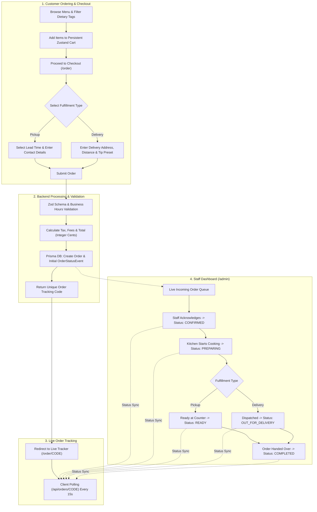
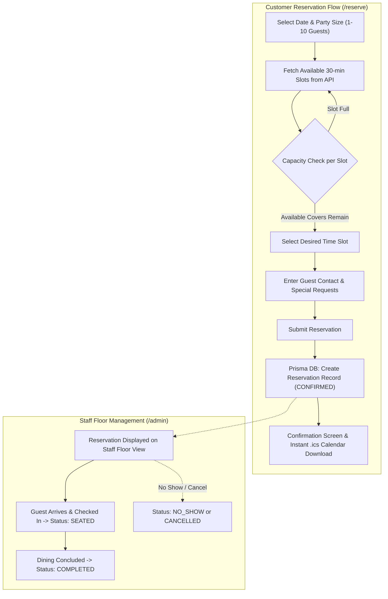
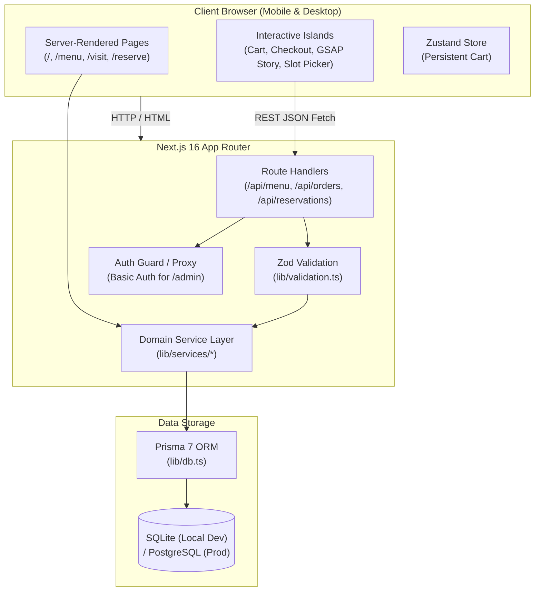

# Ember House — Full-Stack Restaurant Web Platform

[](https://nextjs.org/)
[](https://react.dev/)
[](https://www.typescriptlang.org/)
[](https://tailwindcss.com/)
[](https://www.prisma.io/)
[](https://greensock.com/gsap/)

> **Ember House** is a production-grade, mobile-first restaurant web application engineered with Next.js 16 App Router, React 19, Tailwind CSS v4, Prisma ORM, and GSAP motion. It integrates an interactive dining menu with dietary filtering, a real-time table reservation engine with calendar export, pickup/delivery online ordering with live status tracking, and a dedicated staff administration board.

---

## Key Features

### Interactive Digital Menu
- **Categorized Menu Navigation**: Browse appetizers, wood-fired pizzas, smash burgers, mains, brunch, desserts, and craft drinks.
- **Dietary Filtering & Badges**: Filter items dynamically by Gluten-Free (`GF`), Vegetarian (`VG`), Vegan (`V`), Dairy-Free (`DF`), and Nut-Free (`NF`).
- **High-Definition Media**: Verified high-resolution imagery, detailed descriptions, calorie counts, and dine-in vs. online order availability tags.

### Real-Time Table Reservation Engine
- **Capacity-Aware Time Slots**: 30-minute interval slots with dynamic capacity checking (`maxCoversPerSlot`) to prevent overbooking.
- **Lead-Time & Booking Window Controls**: Configurable lead time rules and advance booking windows.
- **Instant `.ics` Calendar Generation**: Downloadable calendar events for Apple Calendar, Google Calendar, and Outlook.
- **Guest Bookings**: Fast, frictionless reservation process without mandatory user login.

### Online Ordering (Pickup & Delivery)
- **Persistent Cart State**: Powered by Zustand with client-side `localStorage` hydration.
- **Dynamic Pricing Engine**: Automated tax calculations, configurable delivery fee tiers, free delivery thresholds, and tip presets.
- **Delivery Radius Validation**: Business-rule enforcement for delivery radiuses and minimum order subtotals.
- **Live Order Status Tracking**: Dedicated tracking page (`/order/[code]`) with timeline progression (Pending -> Confirmed -> Preparing -> Ready / Out for Delivery -> Completed).

### Staff Administration Dashboard (`/admin`)
- **Live Order Board**: Real-time order monitoring with quick-action status transition buttons.
- **Reservation Manager**: Daily cover count tracking, guest list management, and seating status toggling (`Seated`, `Completed`, `No-Show`, `Cancelled`).
- **Protected Access**: HTTP Basic Authentication proxy barrier protecting admin pages and management API routes.

### Premium UI/UX & Motion
- **GSAP 3 Storytelling Scroll**: Scroll-scrubbed interactive brand narratives and dish presentation layers.
- **Connoisseur Stack Interactor**: Fluid interactive stack card showcases for featured chef specials.
- **Accessible Design Primitives**: Built on top of Radix UI and shadcn/ui components (Sheets, Dialogs, Selects, Accordions, Tabs).
- **Responsive & Mobile-First**: Sticky mobile action bars, quick-access cart slideouts, and touch-optimized date/time pickers.

### Search Engine Optimization (SEO) & Performance
- **Server-Side Rendering (SSR)**: Optimal Core Web Vitals and instant First Contentful Paint (FCP).
- **Structured Data**: Built-in Schema.org `Restaurant` JSON-LD for rich snippets on Google Search and Maps.
- **Dynamic Metadata**: Automatic OpenGraph cards, sitemap (`sitemap.ts`), and robots rules (`robots.ts`).

---

## Project Workflows

### 1. Online Ordering and Fulfillment Lifecycle



### 2. Table Reservation Lifecycle



---

## Architecture & Technology Stack



### Tech Stack Summary

| Layer | Technologies |
|---|---|
| **Framework** | Next.js 16 (App Router), React 19, Server Components |
| **Language** | TypeScript (Strict Mode) |
| **Styling** | Tailwind CSS v4, PostCSS |
| **Component Primitives** | shadcn/ui (Radix UI primitives), Lucide React Icons |
| **Animations** | GSAP 3, `@gsap/react`, ScrollTrigger |
| **State Management** | Zustand (with localStorage persistence) |
| **Validation** | Zod 4 (shared client & server schemas) |
| **Database & ORM** | Prisma 7, SQLite (development) / PostgreSQL (production) |
| **Notifications** | Sonner Toasts |

---

## Project Structure

```plaintext
respro/
├── app/                          # Next.js App Router root
│   ├── (site)/                   # Public site layout & routes
│   │   ├── menu/                 # Interactive menu page
│   │   ├── order/                # Checkout & live order tracking ([code])
│   │   ├── reserve/              # Table reservation flow
│   │   ├── visit/                # Location, opening hours, FAQ, and map
│   │   └── page.tsx              # Home page with GSAP story-scroll
│   ├── admin/                    # Staff management dashboard
│   ├── api/                      # REST API route handlers
│   ├── demos/                    # Standalone component demos
│   ├── globals.css               # Design system tokens & Tailwind imports
│   ├── layout.tsx                # Root layout with fonts, cart hydrator, and toasts
│   ├── robots.ts                 # SEO robots.txt generator
│   └── sitemap.ts                # SEO XML sitemap generator
├── components/                   # Reusable UI component modules
│   ├── admin/                    # Staff board, order cards, status badges
│   ├── cart/                     # Cart slide-over sheet, line items, quantity stepper
│   ├── home/                     # Story sections & signature dish showcase
│   ├── menu/                     # Category lists, item cards, dietary filters
│   ├── order/                    # Checkout form, order summary, tracking view
│   ├── reserve/                  # Date strip, time slot grid, confirmation modal
│   ├── seo/                      # JSON-LD Schema.org structured data
│   ├── site/                     # Site header, footer, clock, mobile action bar
│   └── ui/                       # shadcn/ui and custom animation primitives
├── lib/                          # Application core & utilities
│   ├── data/                     # Seed data (curated menu items & verified images)
│   ├── services/                 # Server-only business domain services (Menu, Orders, Reservations)
│   ├── store/                    # Zustand client state stores (Cart)
│   ├── constants.ts              # System enums & dietary constants
│   ├── db.ts                     # Prisma client singleton
│   ├── format.ts                 # Currency, date, time & phone formatters
│   ├── pricing.ts                # Order subtotal, delivery fee & tax calculations
│   ├── site-config.ts            # Single source of truth for restaurant facts & hours
│   ├── types.ts                  # Shared TypeScript models and API contracts
│   └── validation.ts             # Zod validation schemas
├── prisma/                       # Database layer
│   ├── migrations/               # Prisma migration history
│   ├── schema.prisma             # Database schema definition
│   └── seed.ts                   # Database seeder script
├── docs/                         # Architecture documentation & design specs
│   ├── ARCHITECTURE.md           # Full technical specifications & API contracts
│   └── RESUME.md                 # Project implementation status & notes
├── .env.example                  # Environment variables template
├── package.json                  # Dependencies & scripts
├── tsconfig.json                 # TypeScript configuration
└── next.config.ts                # Next.js configuration
```

---

## Getting Started

### Prerequisites
- **Node.js**: `v20.x` or higher
- **Package Manager**: `npm`, `pnpm`, or `yarn`

### 1. Clone the Repository
```bash
git clone https://github.com/namaysingh3925/RESPO.git
cd RESPO
```

### 2. Install Dependencies
```bash
npm install
```

### 3. Configure Environment Variables
Copy `.env.example` to create your local `.env` file:
```bash
cp .env.example .env
```

Ensure your `.env` contains the required parameters:
```env
# Local SQLite database (or Postgres connection string)
DATABASE_URL="file:./prisma/dev.db"

# Admin credentials for /admin dashboard
ADMIN_USER="admin"
ADMIN_PASSWORD="super-secret-admin-password"

# Set to "false" to allow checkout testing outside restaurant opening hours
ENFORCE_BUSINESS_HOURS="false"

# Base URL for metadata and OpenGraph
NEXT_PUBLIC_SITE_URL="http://localhost:3000"
```

### 4. Database Setup & Migrations
Generate the Prisma Client and apply database migrations:
```bash
# Generate Prisma Client
npx prisma generate

# Apply migrations
npx prisma migrate dev
```

*(Optional)* Launch Prisma Studio to visually inspect database tables:
```bash
npx prisma studio
```

### 5. Run the Development Server
```bash
npm run dev
```

Open [http://localhost:3000](http://localhost:3000) in your browser.

---

## Restaurant Configuration

All restaurant-specific details are centralized in [`lib/site-config.ts`](./lib/site-config.ts). You can rebrand and reconfigure the entire application by modifying this file:

- **Brand & Contact**: Name, tagline, phone number, email, and social handles.
- **Location & Coordinates**: Street address, postal code, and latitude/longitude coordinates (used for directions and Google Maps URLs).
- **Operating Hours**: Granular open and close times per day of the week, with timezone support (`America/New_York`).
- **Reservation Rules**: Party size limits (`1-10`), slot intervals (`30 mins`), max covers per slot (`32`), and lead-time requirements.
- **Ordering & Pricing**: Tax rates, delivery radius in miles, base delivery fees, free delivery order thresholds, and lead times.

---

## Database Schema Overview

```plaintext
User ───────────────< Reservation
  │
  └─────────────────< Order ──────< OrderItem ───> MenuItem ───> Category
                        │
                        └─────────< OrderStatusEvent
```

| Model | Purpose |
|---|---|
| `User` | Staff accounts (with role: `CUSTOMER`, `STAFF`, `ADMIN`) and optional future customer profiles. |
| `Category` | Menu categories (e.g. Burgers, Pizza, Mains, Drinks) with display sort order. |
| `MenuItem` | Dishes and beverages with prices in integer cents, dietary tags, and availability flags. |
| `Reservation` | Table bookings with party size, date/time slot, guest contact details, and status. |
| `Order` | Delivery and pickup orders with full pricing breakdowns, delivery addresses, and fulfillment types. |
| `OrderItem` | Snapshot of ordered menu items with quantities, unit price, and special instructions. |
| `OrderStatusEvent` | Audit log and progression timeline tracking order lifecycle status changes. |

---

## Available NPM Scripts

| Command | Description |
|---|---|
| `npm run dev` | Starts the Next.js local development server on port 3000 |
| `npm run build` | Compiles the production build |
| `npm run start` | Runs the compiled production server |
| `npm run lint` | Runs ESLint to check for code quality and syntax issues |

---

## Admin Access

The staff administration portal is available at `/admin`.

- **Authentication**: HTTP Basic Auth configured via `ADMIN_USER` and `ADMIN_PASSWORD` in your `.env` file.
- **Features**: Live list of incoming customer orders, single-click order stage updates (`Preparing`, `Ready`, `Completed`), and reservation list management.

---

## License

This project is licensed under the [MIT License](LICENSE).
