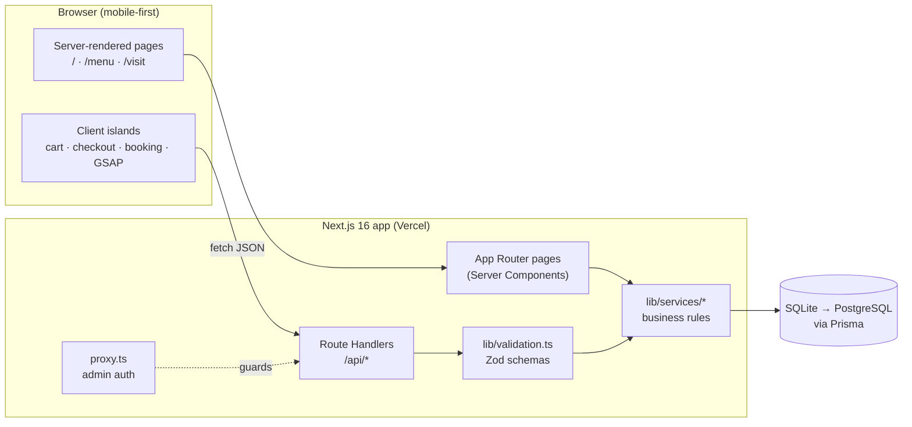
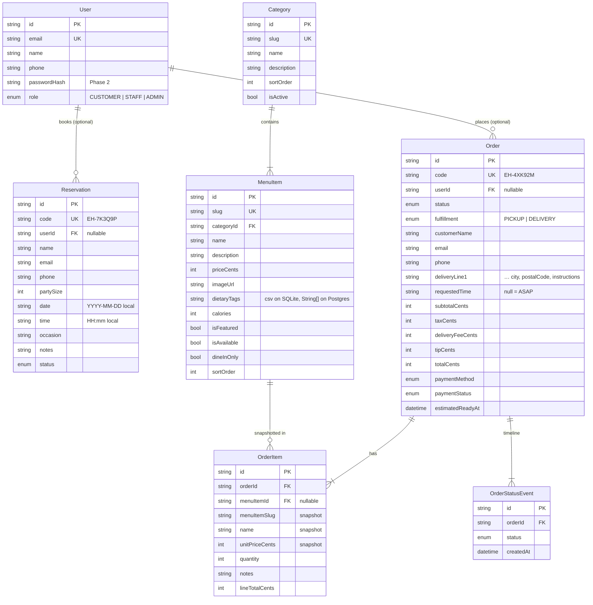

# Ember House — Design & Architecture Plan

> A mobile-first, SEO-friendly restaurant web app with an interactive menu, online table reservations, pickup/delivery ordering, location details and an animated brand story.
> "Ember House" is a placeholder brand; every restaurant fact lives in [`lib/site-config.ts`](../lib/site-config.ts).

**Contents**
0. [Product goals](#0-product-goals)
1. [Tech stack](#1-tech-stack)
2. [Database schema](#2-database-schema)
3. [API endpoints](#3-api-endpoints)
4. [UI/UX wireframes & component hierarchy](#4-uiux-wireframes--component-hierarchy)
5. [Phased implementation plan](#5-phased-implementation-plan)
6. [Component integration notes (GSAP)](#6-component-integration-notes-gsap)
7. [Decisions & open questions](#7-decisions--open-questions)

---

## 0. Product goals

| Goal | What "good" looks like | How the design supports it |
|---|---|---|
| Convert visitors into orders & bookings | ≤ 3 taps from landing to "Place order" / "Reserve" | Sticky mobile action bar (Order · Reserve), cart always one tap away, guest checkout |
| Be found | Ranks for "{cuisine} near me", rich results | Server-rendered pages, `Restaurant` JSON-LD, sitemap, fast LCP |
| Feel premium | Brand story people remember | GSAP story-scroll + clip-path dish showcase, bold typography |
| Run the floor | Staff see new orders & tonight's bookings instantly | `/admin` board with one-tap status changes |
| Stay cheap to operate | One deployable, one database | Next.js full-stack (UI + REST API) on Vercel + managed Postgres |

---

## 1. Tech stack

### Frontend

| Concern | Choice | Why |
|---|---|---|
| Framework | **Next.js 16 (App Router)** + React 19 | Server Components for SEO and speed, file-based routing, Route Handlers for the API in the same repo, ISR for the menu |
| Language | **TypeScript** (strict) | Shared types between DB, API and UI (`lib/types.ts`) |
| Styling | **Tailwind CSS v4** | Mobile-first utilities, CSS-variable theming, zero runtime |
| Components | **shadcn/ui** (Radix primitives) in `components/ui` | Accessible primitives (Sheet, Dialog, Tabs, Select) we own and can restyle |
| Motion | **GSAP 3 + `@gsap/react`** (ScrollTrigger) | Scroll-scrubbed story sections and SVG clip-path reveals; `useGSAP` handles cleanup |
| Icons | **lucide-react** | Tree-shakeable, consistent stroke icons |
| Client state | **Zustand** (persisted cart) | Tiny, no provider, survives reloads via `localStorage` |
| Forms & validation | **Zod 4** schemas shared client ↔ server (`lib/validation.ts`) | One source of truth for rules and error messages |
| Toasts | **sonner** | Lightweight, accessible notifications |
| Fonts | `next/font` — **Plus Jakarta Sans** | Self-hosted, no layout shift |
| Images | `next/image` (Unsplash placeholders → Cloudinary later) | Responsive `srcset`, AVIF/WebP, lazy loading |

### Backend

| Concern | Phase 1 (MVP) | Production / Phase 2+ |
|---|---|---|
| API | **Next.js Route Handlers** (REST, JSON) | Same; extract to a service only if traffic demands |
| ORM | **Prisma 7** (`prisma-client` generator, driver adapters) | Same |
| Database | **SQLite** (`prisma/dev.db`, zero setup) | **PostgreSQL** (Neon / Supabase) — change provider + `dietaryTags` → `String[]` |
| Auth | Staff area behind HTTP Basic auth in `proxy.ts` (env credentials) | **Better Auth / Auth.js** — staff roles, optional customer accounts |
| Payments | Pay in person (pickup / on delivery) | **Stripe** Checkout / Payment Element + webhooks |
| Notifications | On-screen confirmation + tracking page | **Resend** (email), **Twilio** (SMS) |
| Order status updates | Client polling (15 s) | Server-Sent Events or Pusher / Supabase Realtime |
| Rate limiting | — (documented risk) | **Upstash Redis** ratelimit on POST endpoints |
| Hosting | `npm run dev` locally | **Vercel** + Neon; Sentry + Vercel Analytics |
| Testing | Typecheck, lint, API smoke tests | **Vitest** (services), **Playwright** (booking & checkout flows) |

**Why REST, not GraphQL?** The domain is small and well-bounded (menu, reservations, orders). REST GETs are trivially cacheable at the CDN, easy to test with curl/Postman, and need no extra runtime. Server Components call the service layer directly, so the API mainly serves client interactions and future mobile/POS integrations.

### Architecture overview



**Layering rule:** UI never talks to Prisma. Pages (server) and Route Handlers both call `lib/services/*`, which own every business rule (pricing, capacity, status transitions). Services throw `ServiceError` with a typed code; handlers map it to the standard error body.

### Project structure

```
app/
  layout.tsx                 root: fonts, metadata, <Toaster/>, cart hydration
  (site)/                    public site — header, footer, mobile action bar, cart sheet
    page.tsx                 home: story scroll + dish showcase
    menu/page.tsx
    order/page.tsx           checkout
    order/[code]/page.tsx    live order tracking
    reserve/page.tsx
    visit/page.tsx           location, hours, contact, FAQ
  admin/                     staff dashboard (Basic auth via proxy.ts)
  api/                       REST endpoints (see §3)
  demos/                     original component demos (noindex)
  sitemap.ts · robots.ts · not-found.tsx
components/
  ui/                        shadcn primitives + story-scroll + connoisseur-stack-interactor
  site/ home/ menu/ cart/ order/ reserve/ visit/ admin/ seo/
lib/
  site-config.ts constants.ts types.ts validation.ts pricing.ts format.ts showcase.ts
  data/menu.ts               seed menu (verified images)
  services/                  menu · reservations · orders (server-only)
  store/cart.ts              Zustand cart
  db.ts                      Prisma client singleton
prisma/
  schema.prisma  seed.ts  migrations/
docs/ARCHITECTURE.md
proxy.ts
```

---

## 2. Database schema

Full source: [`prisma/schema.prisma`](../prisma/schema.prisma).



### Enums

| Enum | Values |
|---|---|
| `UserRole` | CUSTOMER, STAFF, ADMIN |
| `ReservationStatus` | PENDING → CONFIRMED → SEATED → COMPLETED; CANCELLED, NO_SHOW |
| `OrderStatus` | PENDING → CONFIRMED → PREPARING → READY → (OUT_FOR_DELIVERY →) COMPLETED; CANCELLED |
| `FulfillmentType` | PICKUP, DELIVERY |
| `PaymentMethod` | PAY_IN_PERSON (Phase 1), CARD (Phase 2) |
| `PaymentStatus` | UNPAID, PAID, REFUNDED |

Allowed transitions live in [`lib/constants.ts`](../lib/constants.ts) (`ORDER_TRANSITIONS`, `RESERVATION_TRANSITIONS`) and are enforced by the services.

### Key modelling decisions

1. **Money is integer cents.** No floating-point rounding bugs; tax rounds once per order.
2. **Order lines snapshot name and price.** Editing or deleting a menu item never rewrites order history (`menuItemId` becomes null, the snapshot stays).
3. **Server-side pricing.** Clients send only `{ slug, quantity, notes }`. The server loads prices, rejects unavailable or dine-in-only items, and computes totals with the same pure function the UI uses for estimates (`lib/pricing.ts`).
4. **Reservations use restaurant-local `date` + `time` strings.** Bookings are wall-clock events at one location; storing local strings avoids DST/time-zone drift. "Now" is computed in `siteConfig.timeZone` for lead-time rules. (Multi-location: add `locationId` + per-location zone.)
5. **Capacity = covers per 30-minute slot** (`maxCoversPerSlot`). Simple and good enough for one dining room; Phase 3 upgrades to a `Table` model with turn times.
6. **Guest-first.** `userId` is optional everywhere; accounts are additive in Phase 2.
7. **Short public codes** (`EH-XXXXXX`, Crockford base-32 without look-alike characters) for tracking URLs and phone support. Public lookups mask contact details.
8. **Status history table** gives the tracking timeline and an audit trail for free.

### Postgres migration checklist

- `provider = "postgresql"`, swap the driver adapter to `@prisma/adapter-pg`.
- `dietaryTags String[]` and update the mapper in `lib/services/menu.ts`.
- Add a partial index for active orders: `WHERE status NOT IN ('COMPLETED','CANCELLED')`.
- Wrap reservation capacity checks in a `SERIALIZABLE` transaction (or advisory lock per slot).

---

## 3. API endpoints

**Conventions** — JSON in/out · `201` on create · list responses are wrapped (`{ "orders": [...] }`) · every error returns

```json
{ "error": { "code": "VALIDATION_ERROR", "message": "…", "fieldErrors": { "email": ["Enter a valid email address"] } } }
```

Error codes: `VALIDATION_ERROR 422` · `NOT_FOUND 404` · `SLOT_UNAVAILABLE 409` · `ITEM_UNAVAILABLE 409` · `INVALID_TRANSITION 409` · `MINIMUM_NOT_MET 422` · `RESTAURANT_CLOSED 409` · `UNAUTHORIZED 401` · `RATE_LIMITED 429` · `INTERNAL_ERROR 500`.

### Public

| Method | Path | Purpose | Request | Response |
|---|---|---|---|---|
| GET | `/api/menu` | Full menu grouped by category | `?category=slug` `?dietary=vegan` `?featured=true` | `{ categories: MenuCategoryWithItems[] }` |
| GET | `/api/menu/[slug]` | One dish | — | `MenuItemDTO` |
| GET | `/api/reservations/availability` | Bookable slots for a day | `?date=2026-09-18&partySize=4` | `AvailabilityDTO` |
| POST | `/api/reservations` | Book a table | `{ date, time, partySize, name, email, phone, occasion?, notes? }` | `201 ReservationDTO` |
| GET | `/api/reservations/[code]` | Look up a booking | `?email=` (must match) | `ReservationDTO` |
| POST | `/api/orders` | Place a pickup/delivery order | see below | `201 OrderDTO` |
| GET | `/api/orders/[code]` | Track an order | — | `OrderDTO` (email/phone masked) |

`POST /api/orders` body:

```json
{
  "fulfillment": "DELIVERY",
  "items": [{ "slug": "smash-double-burger", "quantity": 2, "notes": "no pickles" }],
  "customerName": "Sam Rivera",
  "email": "sam@example.com",
  "phone": "(555) 010-2030",
  "deliveryAddress": { "line1": "12th Main Road", "line2": "Flat 4", "city": "Bengaluru", "postalCode": "560038", "instructions": "Buzz 4" },
  "requestedTime": null,
  "tipCents": 300,
  "paymentMethod": "PAY_IN_PERSON",
  "notes": "Extra napkins"
}
```

### Staff (HTTP Basic auth via `proxy.ts`)

| Method | Path | Purpose | Request | Response |
|---|---|---|---|---|
| GET | `/api/admin/orders` | Today's orders (or a date) | `?status=PREPARING` `?date=` | `{ orders: OrderDTO[] }` |
| PATCH | `/api/admin/orders/[id]/status` | Advance / cancel an order | `{ status: "READY" }` | `OrderDTO` |
| GET | `/api/admin/reservations` | Bookings for a date | `?date=` `?status=` | `{ reservations: ReservationDTO[] }` |
| PATCH | `/api/admin/reservations/[id]/status` | Seat / complete / no-show / cancel | `{ status: "SEATED" }` | `ReservationDTO` |

### Phase 2+ endpoints (planned)

| Method | Path | Purpose |
|---|---|---|
| POST/PATCH/DELETE | `/api/admin/menu-items`, `/api/admin/categories` | Menu CMS |
| POST | `/api/checkout/session` | Stripe Checkout session for an order |
| POST | `/api/webhooks/stripe` | Mark orders PAID / REFUNDED |
| GET | `/api/orders/[code]/events` | Server-Sent Events stream for live status |
| * | `/api/auth/*` | Better Auth / Auth.js |

---

## 4. UI/UX wireframes & component hierarchy

### Design system

| Token | Value | Usage |
|---|---|---|
| Ember | `#fd5200` (`bg-ember`, `primary`) | Primary CTAs, active states, accents |
| Charcoal | `#0c0a09` (`bg-charcoal`) | Dark sections, header on scroll |
| Cream / Paper | `#f5f0e8` / `#faf7f2` | Page background, light sections |
| Forest | `#1f3a2e` (`bg-forest`) | Story section, success states |
| Type | Plus Jakarta Sans; display headings `font-black uppercase tracking-tighter leading-[0.85]` | Mirrors the story-scroll look |
| Eyebrow | `text-xs font-bold uppercase tracking-[0.2em]` — "01 — Our story" | Section labels |
| Layout | `mx-auto max-w-7xl px-4 sm:px-6 lg:px-8` | Page container |
| Touch targets | ≥ 44 × 44 px; primary buttons `h-12 rounded-full px-6` | Mobile ergonomics |
| Cards | `rounded-2xl border bg-card` | Menu items, summaries |
| Motion | GSAP only for story/showcase; everything respects `prefers-reduced-motion` | |

### Global mobile chrome

```
┌──────────────────────────────┐
│ ☰  EMBER HOUSE          🛒 3 │  ← SiteHeader (fixed, transparent → solid on scroll)
├──────────────────────────────┤
│                              │
│         page content         │
│                              │
├──────────────────────────────┤
│  [ 🛍 Order online ][ 📅 Book ]│  ← MobileActionBar (fixed bottom, < md only)
└──────────────────────────────┘
```

### Home `/`

```
┌──────────────────────────────┐
│ [full-bleed photo, dark scrim]│  FlowSection 00 — Hero
│ WOOD-FIRED                   │
│ COMFORT FOOD                 │
│ Indiranagar · Open till 11:30pm│  ← live "Open now" status
│ [Order online]  [Book table] │
├──────────────────────────────┤
│ 01 — OUR STORY  (ember bg)   │  FlowSection — rotates in on scroll
│ BORN / FROM / FIRE           │
├──────────────────────────────┤
│ 02 — THE KITCHEN (charcoal)  │  FlowSection — chef photo + 3 pillars
├──────────────────────────────┤
│ 03 — WHAT WE'RE COOKING      │  FlowSection (cream) containing
│  ┌────────────────────────┐  │  ConnoisseurStackInteractor
│  │  clip-path dish reveal │  │  (autoplay; tap a name to switch)
│  └────────────────────────┘  │
│  01 SMASH BURGERS            │
│  02 WOOD-FIRED PIZZA  …      │
│  [See the full menu →]       │
├──────────────────────────────┤
│ 04 — COME HUNGRY (forest)    │  FlowSection — hours, address, map link
│ [Reserve] [Directions]       │
└──────────────────────────────┘
  SiteFooter
```

### Menu `/menu`

```
┌──────────────────────────────┐
│ THE MENU                     │
│ [Vegetarian][Vegan][GF] …    │  ← DietaryFilter (toggle chips)
├──────────────────────────────┤
│ Burgers · Pizza · Bowls · …  │  ← CategoryNav (sticky, horizontal scroll, scroll-spy)
├──────────────────────────────┤
│ BURGERS & GRILL              │  CategorySection
│ ┌─────┐ Smash Double   $16.50│  MenuItemCard (image, name, desc,
│ │ img │ Two smashed…         │  dietary badges, [+ Add] or stepper)
│ └─────┘ [GF]        [ + Add ]│
│ …                            │
│ (md+: interactor showcase    │
│  beside the list)            │
└──────────────────────────────┘
        [ View cart · 3 · $42.10 ]  ← floating on mobile when cart has items
```

### Cart sheet & checkout `/order`

```
Cart (Sheet, right on desktop / bottom on mobile)   Checkout
┌──────────────────────────────┐     ┌──────────────────────────────┐
│ Your order              ✕    │     │ 1  How?  (•) Pickup ( ) Delivery│
│ Smash Double   [- 2 +] $33.00│     │ 2  When? (•) ASAP ( ) Later [▾] │
│ Mint Lemonade  [- 1 +]  $6.50│     │ 3  Address (delivery only)    │
│ ───────────────────────────  │     │ 4  Contact name/email/phone   │
│ Subtotal              $39.50 │     │ 5  Tip [0][10%][15%][20%]     │
│ [ Checkout ]                 │     │ 6  Pay in person (card soon)  │
└──────────────────────────────┘     │ ── Order summary (sticky md+) │
                                     │ [ Place order · $46.43 ]      │
                                     └──────────────────────────────┘
```

### Order tracking `/order/[code]`

```
┌──────────────────────────────┐
│ Order EH-4XK92M              │
│ ● Received      7:02 PM      │
│ ● Confirmed     7:04 PM      │
│ ◐ Preparing     …            │  ← polls every 15 s
│ ○ Ready for pickup           │
│ Est. ready ~7:25 PM          │
│ Items · totals · address     │
└──────────────────────────────┘
```

### Reserve `/reserve`

```
┌──────────────────────────────┐
│ BOOK A TABLE                 │
│ Guests   [- 2 +]             │
│ Date     ‹ Fri 18 · Sat 19 ›│  ← horizontal date strip + native date picker
│ Time     [6:00][6:30][7:00]  │  ← TimeSlotGrid (unavailable = disabled)
│ Name / Email / Phone         │
│ Occasion [▾]  Notes [.....]  │
│ [ Confirm reservation ]      │
└──────────────────────────────┘
 → ReservationConfirmation (code, add-to-calendar, directions)
```

### Visit `/visit`

Map embed · address + [Directions] · hours table with today highlighted · phone/email tap-to-call · parking & accessibility · FAQ accordion · JSON-LD.

### Admin `/admin`

Tabs: **Orders** (columns by status on desktop, status filter chips on mobile; each card has the next-status button) · **Reservations** (date picker, list grouped by time, Seat / Complete / No-show / Cancel).

### Component hierarchy

```
RootLayout (fonts, Toaster, CartHydrator)
├── (site)/layout
│   ├── SiteHeader ─ Logo · DesktopNav · CartButton · MobileNav(Sheet)
│   ├── {page}
│   ├── SiteFooter ─ hours · address · links
│   ├── MobileActionBar
│   └── CartSheet ─ CartLine[] (QuantityStepper) · CartSummary
├── (site)/page  (Home)
│   └── FlowArt
│       ├── FlowSection Hero ─ OpenStatus · CTA buttons
│       ├── FlowSection Story
│       ├── FlowSection Kitchen
│       ├── FlowSection Showcase ─ ConnoisseurStackInteractor(HOME_SHOWCASE)
│       └── FlowSection Visit ─ HoursSummary · CTA
├── (site)/menu/page
│   ├── MenuHero · DietaryFilter
│   ├── CategoryNav (scroll-spy)
│   └── CategorySection[] ─ ConnoisseurStackInteractor (md+) · MenuItemCard[] (AddToCart / QuantityStepper)
├── (site)/order/page ─ CheckoutForm (FulfillmentToggle · TimePicker · AddressFields · ContactFields · TipSelector) · OrderSummary
├── (site)/order/[code]/page ─ OrderTracker (StatusTimeline · OrderSummary)
├── (site)/reserve/page ─ ReservationForm (PartySizePicker · DateStrip · TimeSlotGrid · ContactFields) · ReservationConfirmation
├── (site)/visit/page ─ MapEmbed · HoursTable · ContactCard · Faq · RestaurantJsonLd
└── admin/page ─ AdminTabs ─ OrdersBoard(OrderCard[]) · ReservationsList(ReservationRow[])
```

### Responsive behaviour

- **< 640 px:** single column, bottom action bar, cart as bottom sheet, interactor shows image first then the dish list (auto-advances).
- **≥ 768 px:** header nav inline, interactor side-by-side, checkout summary sticky on the right.
- **≥ 1024 px:** menu shows the showcase beside each category; admin orders as status columns.

---

## 5. Phased implementation plan

### Phase 0 — Foundation ✅
- [x] Next.js 16 + TypeScript + Tailwind v4 + shadcn/ui (`components/ui`)
- [x] GSAP components integrated: `story-scroll.tsx`, `connoisseur-stack-interactor.tsx` (+ demos at `/demos/*`)
- [x] Brand tokens, Plus Jakarta Sans, site config, domain constants, shared types, Zod schemas, pricing, cart store
- [x] Prisma schema + verified seed menu (29 dishes, 6 categories)

### Phase 1 — MVP (this build)
| # | Workstream | Deliverables | Done when |
|---|---|---|---|
| 1 | Data layer | Prisma client, migration, seed, services, route handlers, `proxy.ts` | `npm run db:reset` seeds; curl smoke tests pass |
| 2 | Site shell & home | Header, mobile nav, action bar, footer, story-scroll home, visit page, SEO (metadata, JSON-LD, sitemap, robots) | Lighthouse SEO ≥ 95; reduced-motion works |
| 3 | Menu | Category nav, dietary filter, item cards, showcase, add-to-cart | Every dish shows image, price, badges; dine-in-only can't be added |
| 4 | Ordering | Cart sheet, checkout, order creation, tracking page | Guest can order pickup/delivery in ≤ 3 screens; server recomputes totals |
| 5 | Reservations | Availability, slot picker, booking, confirmation | Full slots disabled; double-booking beyond capacity rejected |
| 6 | Staff admin | Orders board, reservations list, status changes | Status change reflects on tracking page within 15 s |
| 7 | Hardening | Build, lint, typecheck, review pass, mobile QA | `npm run build` clean; no hydration warnings |

### Phase 1.1 — Launch readiness (≈ 1 week)
- Vitest for `pricing`, availability and transitions; Playwright for booking + checkout
- Rate limiting on `POST /api/orders` and `POST /api/reservations`; honeypot field
- Email confirmations (Resend) for bookings and orders
- Deploy: Vercel + Neon Postgres, env vars, custom domain, Sentry, analytics
- Real photography, menu copy, legal pages (privacy, terms, allergens)

### Phase 2 — Revenue & operations (≈ 3–4 weeks)
- Stripe card payments + webhooks, refunds from admin
- Auth: staff roles replace Basic auth; optional customer accounts (order history, saved addresses)
- Menu CMS in admin (CRUD, availability toggles, 86'd items, image upload)
- Real-time order updates (SSE), kitchen display mode, sound alerts
- Delivery zones by ZIP/radius with fees; scheduled orders for later days
- SMS notifications (Twilio) for "ready" / "out for delivery"

### Phase 3 — Growth (ongoing)
- Table-level reservation engine (turn times, table combos), waitlist
- Loyalty & gift cards, promo codes
- Reviews/UGC, Instagram feed
- Multi-location + i18n, PWA install and push
- POS / aggregator integrations (Square, Toast, DoorDash Drive)

---

## 6. Component integration notes (GSAP)

### Why `components/ui`?
shadcn's CLI resolves the `ui` alias in `components.json` to `@/components/ui`. Keeping third-party and generated primitives there means:
- `npx shadcn add …` installs next to them and their `@/lib/utils` imports resolve;
- imports stay stable (`@/components/ui/story-scroll`) as the app grows;
- "design-system primitives" (`components/ui`) stay separate from feature components (`components/menu`, `components/order`…).

### `story-scroll.tsx` (FlowArt / FlowSection) — copied verbatim
- Client component; registers `ScrollTrigger`. Each `FlowSection` after the first rotates from 30° to 0° as it enters, while the previous section pins underneath (`pinSpacing: false`).
- **Renders its own `<main>`** — pages using it must not wrap it in another `<main>`.
- Sections get `z-index` 1…n; the fixed site header uses `z-50` so it stays on top.
- Don't put `position: fixed` or `position: sticky` elements inside a `FlowSection` (the transformed, `overflow-hidden` container breaks both).
- Honors `prefers-reduced-motion` (no pinning/rotation).

### `connoisseur-stack-interactor.tsx` — integrated with fixes
Changes from the original, all backwards-compatible (`<Component />` still renders the three-item demo):

| Change | Why |
|---|---|
| `"use client"` | Uses hooks + GSAP; required in the App Router |
| `useGSAP` with `revertOnUpdate` instead of `useLayoutEffect` + manual timelines | Hover-created timelines were never killed → leaked infinite loops after navigation |
| Instance-unique clip-path ids (`useId`) | Two interactors on one page (menu) would otherwise share `#clip-original` |
| Items are `<button>`s with focus + click, not hover-only `<li>`s | Touch and keyboard users could not switch dishes |
| Image first on mobile, optional `autoPlay` | On phones the image sat below a long list, so taps changed something off-screen |
| Names split into first word + rest | Original dropped words after the second ("Smash Double Burger" → "Smash Double") |
| Four new shapes: `clip-slices`, `clip-plates`, `clip-arches`, `clip-stripes` | Seven items on the homepage, each with a food-appropriate reveal |
| Optional `caption`, `density`, `onActiveChange` | Prices / CTAs under the active dish; tighter layout for long menus |
| Pauses when off-screen; preloads images; reduced-motion shows the static image | Performance and accessibility |

---

## 7. Decisions & open questions

Answers to the integration checklist, with the defaults chosen for this build:

| Question | Default chosen | Change it in |
|---|---|---|
| What data/props are passed? | `FlowArt` takes `FlowSection` children only. The interactor takes `items: StackItem[]` built from the DB (`toStackItems`) or `HOME_SHOWCASE` | `lib/showcase.ts` |
| State management? | Local component state for animations; Zustand for the cart; server state from services (no client cache library needed yet) | `lib/store/cart.ts` |
| Required assets? | Unsplash photos (each URL checked for HTTP 200 and visually matched); lucide icons; no local files | `lib/data/menu.ts` → `PHOTOS` |
| Responsive behaviour? | Mobile-first; see §4 "Responsive behaviour" | — |
| Best place to use them? | Story scroll = homepage brand story; interactor = homepage "What we're cooking" + per-category showcase on the menu page | `app/(site)/page.tsx`, `app/(site)/menu` |

**Open questions for the restaurant owner**
1. Real name, cuisine, address, hours and menu (all placeholders today)?
2. Delivery in-house or via a partner (DoorDash Drive / Uber Direct)? This changes Phase 2 delivery zones.
3. Deposits or card holds for large parties / peak nights?
4. POS in use (Square, Toast, Clover)? Integrating early avoids double entry.
5. Alcohol delivery laws in your state — currently cocktails are dine-in only.
